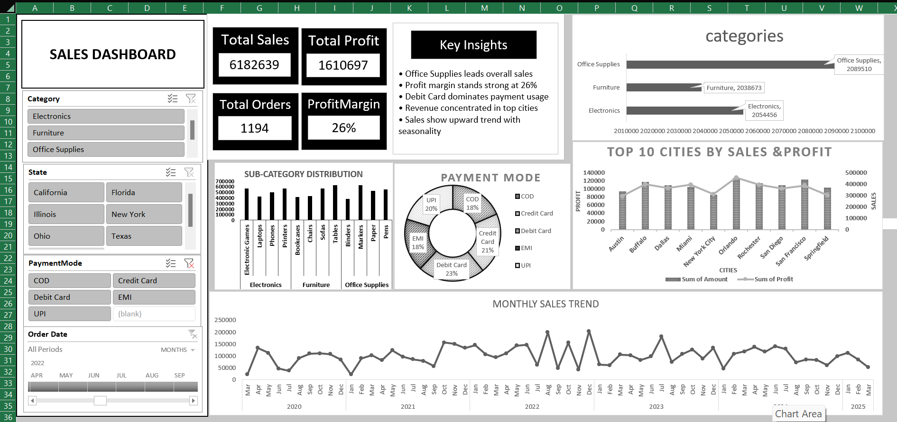

# 📊 Sales Dashboard (Excel)

## 📌 Overview

This project is an interactive Sales Dashboard built using Microsoft Excel to analyze sales performance, profit trends, and customer purchasing behavior.

---

## 🎯 Objective

* Analyze sales performance
* Identify top-performing categories
* Track profit and revenue trends
* Understand customer payment behavior

---

## 🚀 Features

* Interactive filters (Category, State, Payment Mode, Date)
* KPI Metrics: Sales, Profit, Orders, Profit Margin
* Monthly Sales Trend
* Top Cities Analysis
* Category & Sub-Category Insights
* Payment Mode Distribution

---

## 🛠️ Tools Used

* Microsoft Excel
* Pivot Tables
* Charts
* Slicers

---

## 📂 Dataset

Dataset from Kaggle:
https://www.kaggle.com/datasets/shantanugarg274/sales-dataset

---

## 🖼️ Dashboard Preview

---

## 📁 Project Structure

salesdashboard/
│── Sales_Dashboard.xlsx
│── README.md

├── data/
│   └── sales_data.csv

├── images/
│   └── dashboard_preview.png

---

## 💡 Key Insights

* Office Supplies has highest sales
* Profit margin is around 26%
* Debit Card is most used payment mode
* Sales show consistent growth trend

---

## 📬 Conclusion

This project shows how Excel can be used to create interactive dashboards and extract meaningful business insights from raw data.
